# Azure Databricks CICD With GitHub Actions
### Solution presents an end to end sample for code promotion with Azure Databricks using GitHub Action.
#### The code works with Databricks PAT token for Authorization to call the Databricks REST API.
#### This will show you how to deploy your Databricks assets via GitHub Actions so that your artifacts are automatically deployed and configured per environment. The items covered in the code are :
-   Notebooks
-   Folders
-   Clusters
-   Jobs
-   Pools
The flow of the deployment in the sample is
**developer workspace notebook -> GitHub Repo -> Dev Environment -> QA -> Prod**
 The flow can be adjusted as per teams code promotion policy

## Creating and setting up GitHub Repo

### Using GitHub Action
#### Clone this repo (copy only the Assets folder content ) to your GitHub.
•	If the action tab is not auto populated in your repo, create an emty action and copy the Asset/Workflow/Databricks_CICD.yml content into the workflow names Databricks_CICD

#### Once you create a copy of the repo, the code along with the Environment will be copied to you repo
• Set the Secrets for each environment in this case 
		○ Dev
		○ QA
		○ Prod

• Click on Settings | Environments | Select each Environment and create a secrets named
		○ DATABRICKS_HOST - will have the Databricks URL in this
		○ DATABRICKS_TOKEN - PAT Token of  respective Databricks workspace.

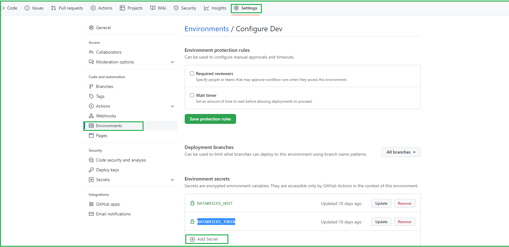

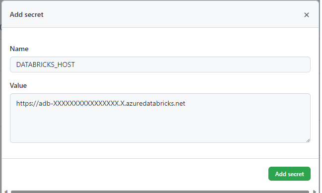

### In Databricks Dev workspace, set up the Repo.

#### We need to set the repo connection only in the dev Databricks workspace.

• Create Git Token 

Go to Users -> Setting -> Developer Settings -> Personal access tokens -> Generate new token | Select repo and workflow checkbox

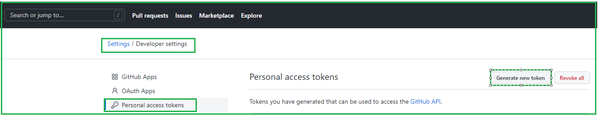

• Login into the dev workspace.

• Go to User Settings -> Git Integration -> Select the below option | paste the Token generated from Git

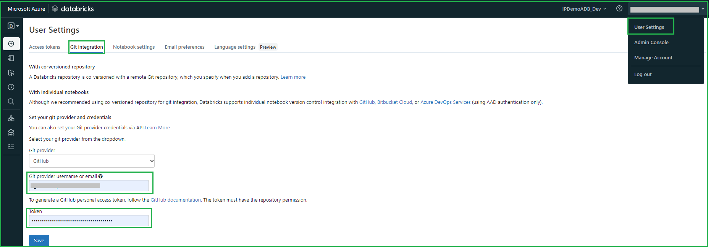

• Then go to repo tab and add the git repo

Code -> copy the HTTPS link to the repo

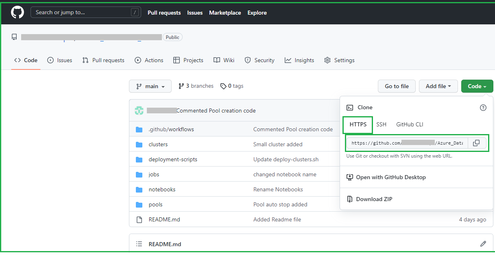

• Add the copied repo link in the Databricks workspace
		Repo -> Add Repo -> copy the repo link
			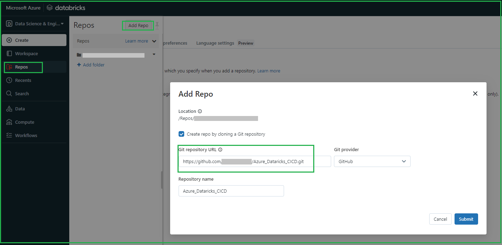

• Create a new feature branch from main pull the code into feature branch.
			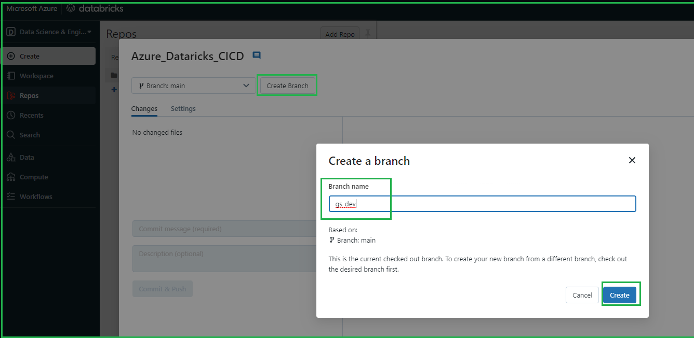

• Copy/move your completed and tested notebooks , folders into the repo. There are some sample clusters, jobs, pool code in repo which can be deployed in various environment.

• You can create or update the code using VS code or any other IDE and commit the changes to the main branch to trigger the code movement from

§ Repo -> Dev -> QA -> Prod

• Once the changes are done in repo, commit the changes to the remote branch and create a PR. 

• Approval of PR initiates the git Action to deploy the code into Dev. For QA and Prod a reviewer can be added.

### Setup the approval gateway for UAT and Prod

#### We need to set the reviewer's before the code is deployed into the environement to have a check on what is deployed.

in the GitHub repo go to

Settings -> Environment -> Select the environment (UAT/PROD)

Check the Required reviewers and add the mail id of the members who can approve the deployment. Then Click :Save protection rules"

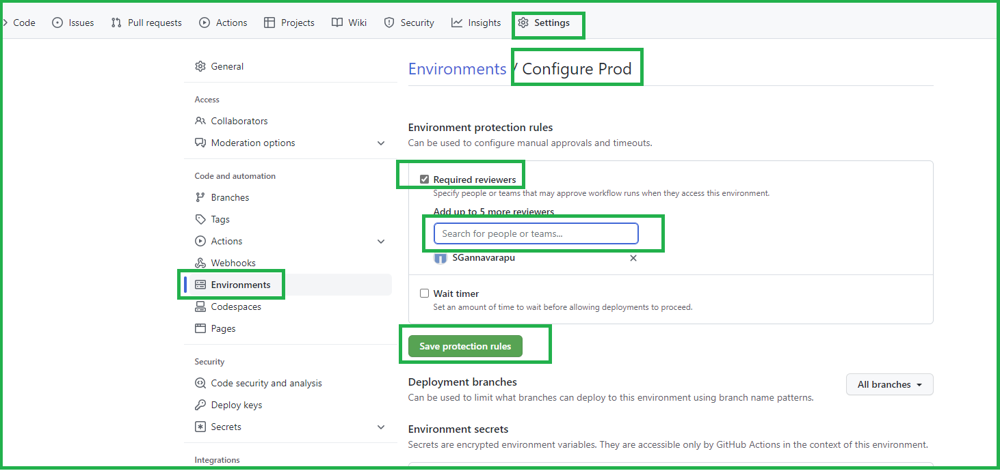

### Adding JAR file to be deployed on the cluster

#### For Jar files where size < 25 MB just add the files in the jar folder in the repo and include the jar in the cluster scope init / global init script as per the requirement.

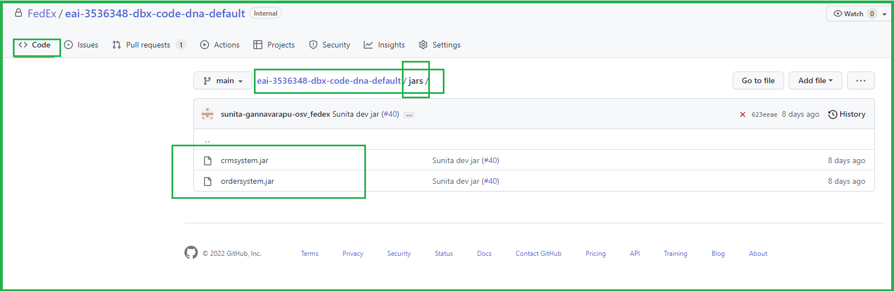

#### For Setup of jar files where size > 25 mb, it needs to be added in the Databricks dbfs folder
For adding the jar in the databricks workspace Goto :
* Admin Console -> Advanced  -> enable "DBFS File Browser: Enabled"
* Refresh the browser

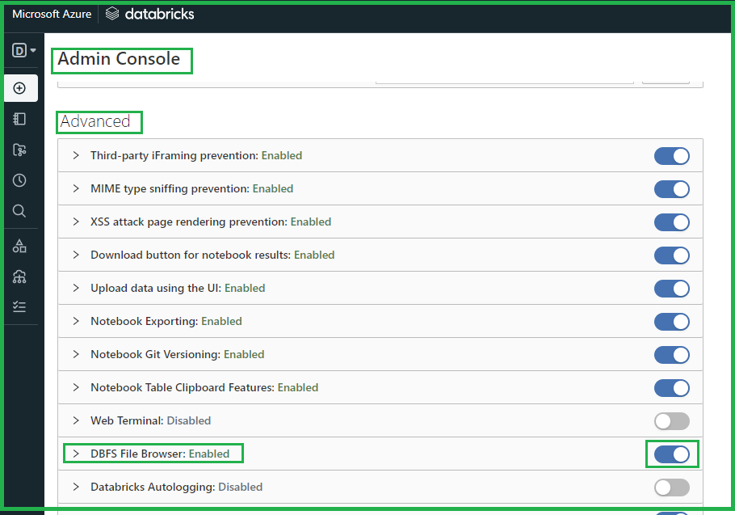

* After browser refresh go to the Data tab 
* Select DBFS
* Select the jar loaction : FileStore/jars
* Select Upload tab and browse the jar file and ok
  Jar file will be uploaded to the location and can be installed on the required cluster like other exisiting jar files.

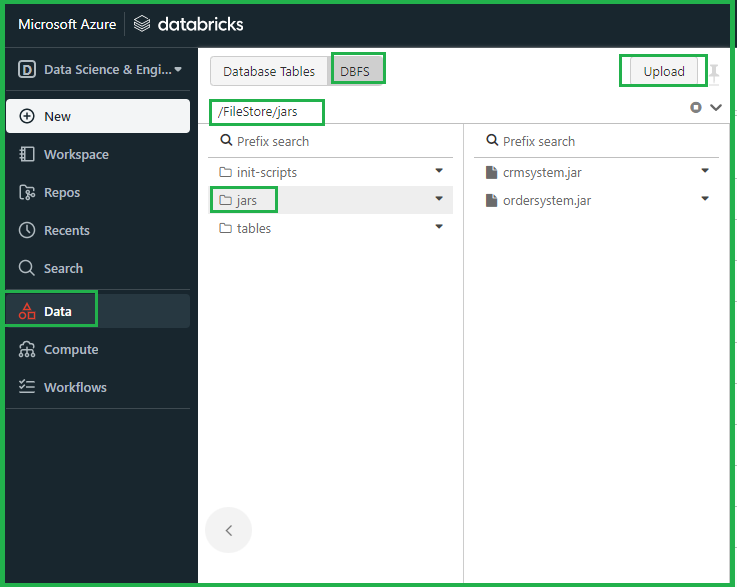

### Adding Global init script

#### Global init script installs the dependencies or perform initial script on all the clusters in the databricks work space as against the cluster-scope init script.
To add Global Init script Go to :
* Admin Console -> Global init Scripts -> Add -> include the scipt and save -> Enable/Disable the script as required.

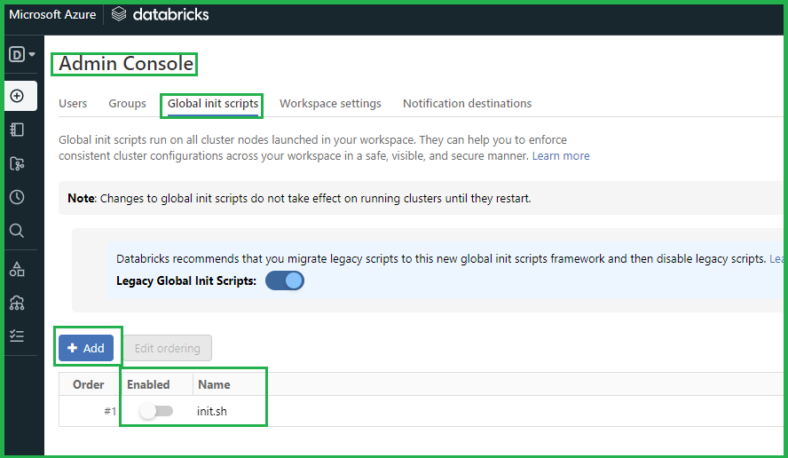
